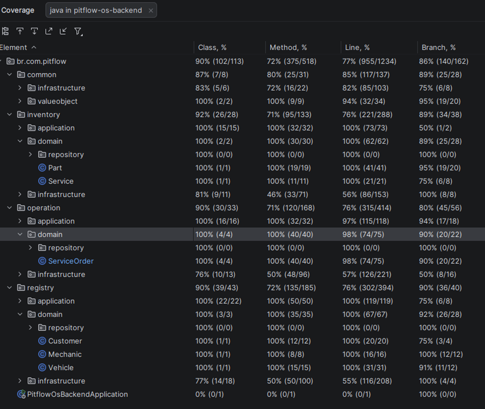
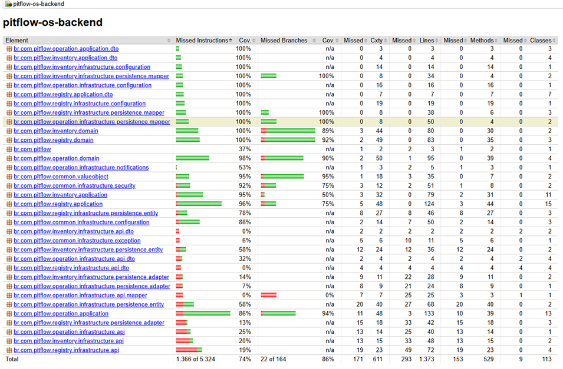

# PitFlow OS - Backend 🛠️

O **PitFlow OS** é uma solução robusta para a gestão de ordens de serviço (OS), clientes, veículos e estoque em oficinas mecânicas. Este projeto representa o MVP (Minimum Viable Product) desenvolvido para a **Fase 1 do Tech Challenge** da Pós-Graduação em Software Architecture (FIAP).

---

## 🏗️ Decisões de Arquitetura

### 💾 Banco de Dados: PostgreSQL
A escolha do **PostgreSQL** como banco de dados relacional foi estratégica e baseada em:
* **Integridade e Consistência**: O domínio de uma oficina exige forte consistência entre Clientes, Veículos e Peças. O suporte a transações ACID do Postgres garante que uma OS nunca fique em estado inconsistente.
* **Contexto Relacional**: As fronteiras dos *Bounded Contexts* identificados possuem relações claras que são mapeadas de forma eficiente em um modelo relacional.
* **Expertise Técnica**: A familiaridade prévia com a ferramenta permitiu uma modelagem segura e a utilização de recursos avançados de indexação e performance.

### 🧩 Design de Software (DDD)
O projeto utiliza os princípios do **Domain-Driven Design**, separando o código em camadas que isolam a complexidade do negócio da infraestrutura tecnológica:
* `api`: Controladores REST e DTOs de entrada/saída.
* `application`: Casos de uso que orquestram a execução das regras de negócio.
* `domain`: Onde residem os Agregados, Entidades, Objetos de Valor e as interfaces dos Repositórios (o "coração" do sistema).
* `infrastructure`: Implementações de persistência (JPA), segurança (JWT) e configurações externas.

### 🗂️ Bounded Contexts
O projeto foi estruturado em três *Bounded Contexts* principais, refletindo as áreas funcionais da oficina:
1.  **Registry**: Cadastro, atualização e consulta de clientes e seus veículos.
2.  **Operations**: Criação, atualização e acompanhamento do status das OS.
3.  **Inventory**: Controle de peças, entradas e saídas de estoque.

Um Bounded Contexts auxiliar foi criado para gerenciar os Objetos de valor e autenticação, definido como **Common**.

---

## 🚀 Tecnologias e Requisitos

* **Java 21**: Utilização de recursos modernos da linguagem.
* **Spring Boot 3.4+**: Base para o ecossistema da aplicação.
* **Maven**: Automação de build e gestão de dependências.
* **Docker & Docker Compose**: Padronização do ambiente de execução.
* **Liquibase**: Gestão de migrações e versionamento do banco de dados.

---

## 📦 Como Executar

### Pré-requisitos
* Docker e Docker Compose instalados.

### Passo a Passo
1.  Clone este repositório.
2.  Na raiz do projeto (onde está o arquivo `docker-compose.yml`), execute:
    ```bash
    docker-compose up --build
    ```
3.  A aplicação estará disponível em `http://localhost:8080`.
4.  A documentação interativa das APIs (Swagger/OpenAPI) pode ser acessada em:
    `http://localhost:8080/swagger-ui.html`

---

## 🛡️ Qualidade e Segurança

### Cobertura de Testes (JaCoCo)
Conforme os requisitos da Fase 1, os testes automatizados focaram nos domínios críticos (**Domain** e **Application**), atingindo coberturas superiores a **80%**.
Abaixo um exemplo da cobertura de testes obtida pelo JaCoCo, por meio de plugin do IntelliJ:



Foi adicionado também a dependência do Jacoco no projeto podendo gerar o relatório de cobertura via Maven com o comando:
```bash
mvn clean verify
```
Arquivo ficará disponível em:
`target/site/jacoco/index.html`



No relatório gerado, temos a cobertura detalhada por pacote e classe, destacando a cobertura acima de 80% para os pacotes `domain` e `application`.

### Análise de Vulnerabilidades (OWASP Dependency-Check)

Utilizamos a ferramenta **OWASP Dependency-Check** integrada ao Maven para análise estática de dependências (SCA).
Para executar o scan, é necessário obter uma **API KEY**, pelo site: https://nvd.nist.gov/developers/request-an-api-key
```bash
mvn org.owasp:dependency-check-maven:check -Dnvd.api.key=<API_KEY>
```
#### Durante a primeira execução foi observados alguns pontos de atenão:

**Pontos identificados e mitigados:**
1.  **Spring Boot DevTools (CRITICAL)**: Vulnerabilidade relacionada ao `SnakeYAML`.
    * **Mitigação**: A dependência foi configurada com `<optional>true</optional>` e escopo `test`. Além disso, utilizamos **Multi-stage Build** no Dockerfile para garantir que o JAR final de produção contenha apenas o JRE e o código necessário, removendo o DevTools completamente da imagem final.
2.  **Swagger UI (MEDIUM)**: Relacionada à biblioteca `DOMPurify` nos assets estáticos.
    * **Mitigação**: Atualização do starter `springdoc-openapi` para a versão mais recente e recomendação de desativação do endpoint em ambientes produtivos críticos.


Após a mitigação dos pontos acima, uma nova análise foi realizada, não sendo mais identificadas vulnerabilidades.


---

## 🗺️ Entregas de Design (DDD)

A documentação completa contendo o **Event Storming** (Criação de OS e Gestão de Peças), o **Dicionário de Linguagem Ubíqua** e os diagramas de contexto podem ser acessados na pasta `/docs` deste repositório.

---
**Desenvolvido como parte do Tech Challenge - SOAT - FIAP.**