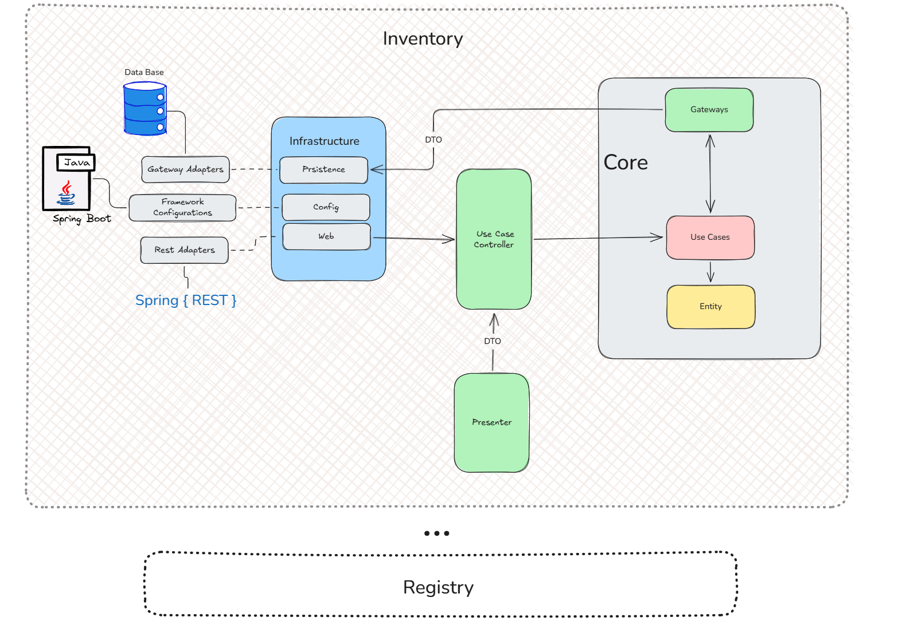
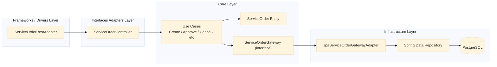
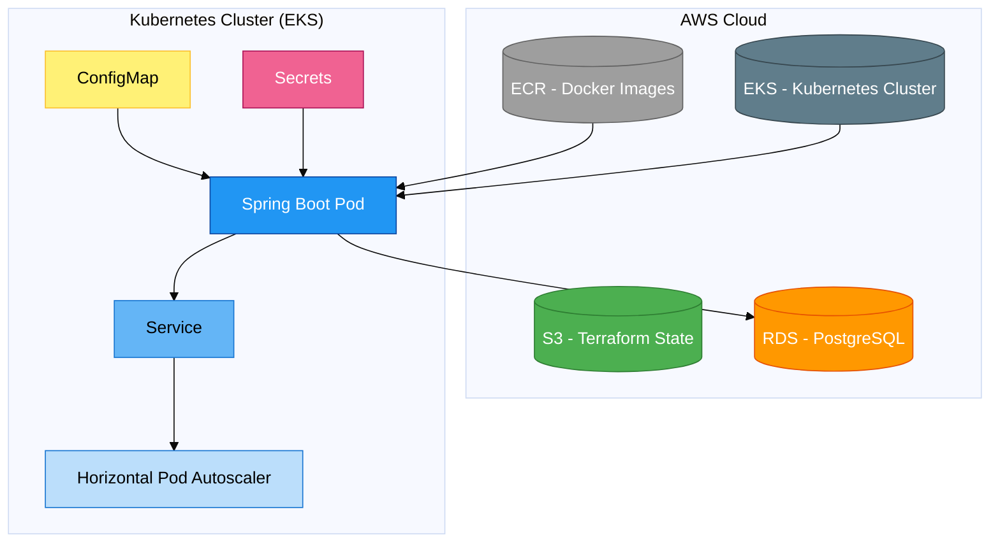
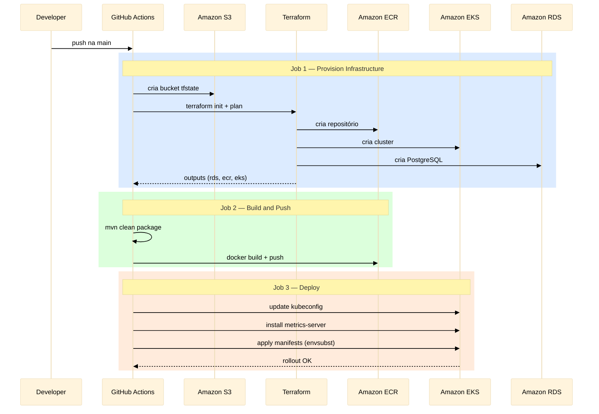

# PitFlow OS - Backend 🛠️ (Fase 2)

Aplicação backend orientada a domínio (DDD), baseada em Clean Architecture, executando em ambiente cloud-native (Kubernetes), com infraestrutura como código (Terraform) e pipeline CI/CD automatizado.

📌 **Links Importantes:**
* 🎬 **Vídeo Demonstrativo:** [Link do Vídeo](https://drive.google.com/file/d/1ljDp4kCbxxXPZbn11ddynvWAL2PC5_7g/view?usp=sharing).
* 📚 **Collection / Swagger API:** A documentação interativa (OpenAPI) fica disponível em `http://localhost:8080/swagger-ui.html` quando a aplicação está em execução, localmente.

---
## ⚒️ Requisitos
* **Java 21** (openjdk 21.0.2)
* **Docker/Docker-compose** ( version 29.1.4-rd)
* **aws cli** (aws-cli/2.34.11)
* **Terraform** (v1.14.7)

## 🏗️ 1. Arquitetura (Clean Architecture)

A aplicação foi completamente refatorada seguindo os princípios da **[Clean Architecture](https://blog.cleancoder.com/uncle-bob/2012/08/13/the-clean-architecture.html)** (Arquitetura Limpa), garantindo que as regras de negócio sejam o coração do sistema, independentes de frameworks, bancos de dados ou interfaces web.

### Organização em Módulos
O código está estruturado em quatro Bounded Contexts principais:
1. **`common`**: Elementos transversais (Filtros JWT, Gateways abstratos como `TransactionGateway`, Handlers de exceção).
2. **`registry`**: Gestão de clientes, veículos e autenticação de mecânicos.
3. **`inventory`**: Catálogo de peças e serviços.
4. **`operation`**: Máquina de estados e ciclo de vida das Ordens de Serviço (Abertura, Diagnóstico, Aprovação, Execução e Finalização).

## 🧠 Decisões Arquiteturais

- Separação entre Controller (Application) e REST Adapter (Infrastructure)
- Uso de Gateways para inversão de dependência.
- DTOs para isolamento e controle de contexto no transporte de dados.
- Kubernetes para escalabilidade horizontal.

### O Fluxo de Dependência
A regra de dependência aponta sempre para o centro (`core`):
* **Core:** Contém *Entities*, *Value Objects* e *Use Cases* puros (Java puro, sem anotações de Spring).
* **Infrastructure:** Contém os *Adapters* que implementam as interfaces (Gateways) do Core. Aqui residem a implementação de Frameworks e Drivers, como as lógicas de JPA, Security, Webhooks, REST e mapeamento relacional.
* **Controllers:** Responsáveis por receber a entrada, transformar em comandos e delegar aos casos de uso.
* **Presenters:** Responsáveis por formatar a saída (DTOs) para o mundo externo. <br>



**Exemplo de caso de uso:**



---

## ☁️ 2. Infraestrutura e Orquestração (Cloud & IaC)

O projeto foi modernizado para rodar em um ambiente escalável na **AWS**.

### Infraestrutura como Código (Terraform)
Localizado na pasta `infra/terraform`, o IaC provisiona:
* **Amazon EKS:** Cluster Kubernetes e Node Group (capacidade SPOT).
* **Amazon RDS:** Banco PostgreSQL 16 gerenciado.
* **Amazon ECR:** Repositório privado de imagens Docker.
* **Amazon S3:** Backend remoto para guardar o estado do Terraform (`tfstate`).

### Orquestração (Kubernetes)
Localizado na pasta `infra/k8s`, os manifestos definem a topologia:
* **Deployment:** Responsável por manter os pods da aplicação.
* **Service:** Exposição da aplicação via Service do tipo LoadBalancer.
* **ConfigMaps e Secrets:** Injeção de variáveis de ambiente (`DB_HOST`, senhas e JWT) desacopladas da imagem da aplicação.
* **Probes (Liveness/Readiness/Startup):** Garantem a autorrecuperação dos pods usando o Spring Actuator (`/actuator/health`).
* **HPA (Horizontal Pod Autoscaler):** Escalonamento automático de 1 para até 3 réplicas com base no consumo de CPU (alvo: 70%).

Segue a representação da estrutura:


---

## 🚀 3. Pipeline CI/CD (GitHub Actions)

A esteira de entrega contínua (`.github/workflows/main.yaml`) automatiza todo o
processo em três jobs sequenciais:

1. **Provision Infrastructure:** Garante a existência do bucket S3 para o estado
   remoto do Terraform, executa `terraform init`, `plan` e `apply`, provisionando
   ECR, EKS e RDS. Exporta os endpoints e nomes como outputs para os jobs seguintes.

2. **Build and Push:** Executa `mvn clean package` (compila, testa e empacota),
   autentica no Amazon ECR e envia a imagem Docker com duas tags: o SHA do commit
   e `latest`.

3. **Deploy to Kubernetes:** Atualiza o kubeconfig do EKS, instala o
   `metrics-server` (pré-requisito do HPA), substitui os placeholders dos
   manifestos via `envsubst` injetando secrets do GitHub, aplica todos os
   manifestos e valida o rollout do deployment.

---

## 📦 4. Como Executar o Projeto

Para o histórico de testes de qualidade (JaCoCo, OWASP Dependency-Check) e o teste prático de escalabilidade do HPA, consulte a pasta `/doc`.

### Opção A: Execução Local (Docker Compose)
A maneira mais rápida de rodar o ambiente de desenvolvimento:
1. Renomeie o arquivo `.env.example` para `.env` (se aplicável) ou apenas utilize as variáveis padrão.
2. Na raiz do projeto, execute:
   ```bash
   docker-compose up --build
   ```
3. O PostgreSQL e a aplicação subirão juntos. Siga o roteiro de testes disponível no arquivo [HOMOLOGACAO.md](doc/HOMOLOGACAO.md).

### Opção B: Provisionamento Terraform Local
O deploy principal é automatizado pela GitHub Action ao realizar um push na `main`. <br>
Código da action disponível em: <br>

👉 doc/[EXECUCAO_TERRAFORM_LOCAL.md](doc/EXECUCAO_TERRAFORM_LOCAL.md).

### Opção C: Deploy no Kubernetes
⚠️ **Atenção:** Para o correto funcionamento do fluxo de CI/CD no GitHub Actions, é estritamente necessário configurar as seguintes *Secrets* no repositório:
* AWS_ACCESS_KEY_ID
* AWS_SECRET_ACCESS_KEY
* AWS_SESSION_TOKEN
* DB_PASSWORD
* JWT_SECRET

Execução da action disponibilizada em: [github/workflows/main.yaml](.github/workflows/main.yaml). <br>

### Testes unitários
````bash
mvn clean test
````

### 📊 Validações e Roteiros de Teste
A documentação detalhada das provas de conceito e histórico de qualidade encontra-se na pasta `/doc`:
* 🧪 **Roteiro de Homologação (MVP):** [HOMOLOGACAO.md](doc/HOMOLOGACAO.md)
* 📈 **Teste de Escalonamento Automático (HPA):** [TESTE_HPA.md](doc/TESTE_HPA.md)
* 🛡️ **Qualidade e Cobertura (JaCoCo):** [QUALIDADE_SEGURANCA.md](doc/QUALIDADE_SEGURANCA.md)
* 🔒 **Análise de Vulnerabilidades (OWASP):** [OWASP.md](doc/OWASP.md)
