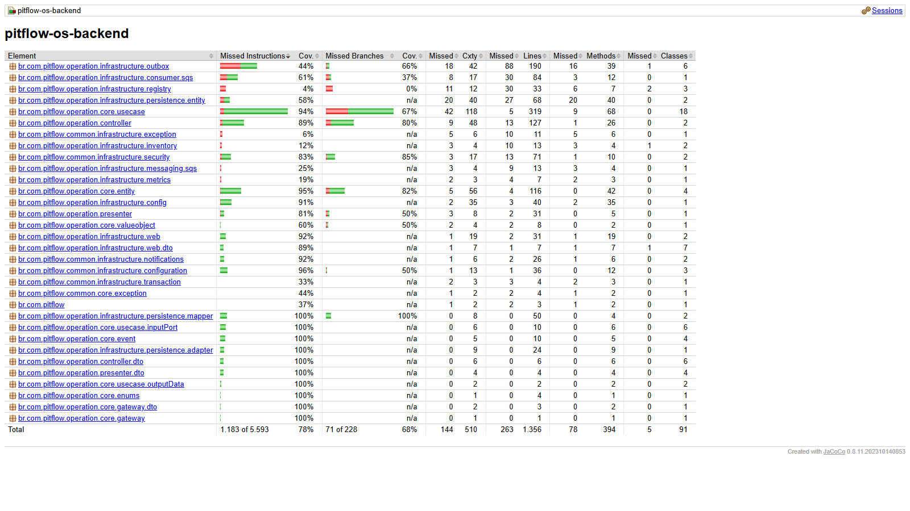

# PitFlow Operation

Microsserviço responsável pelo ciclo de vida das ordens de serviço do PitFlow.
O nome histórico do repositório é `pitflow-os-backend`, mas seu único domínio de
negócio atual é **Operation**.

## Responsabilidades

- abrir e consultar ordens de serviço;
- controlar diagnóstico, orçamento, execução, finalização e entrega;
- validar cliente e veículo no Registry;
- reservar peças e consultar serviços no Inventory;
- publicar eventos de domínio por transactional outbox e SQS;
- consumir comandos da SAGA enviados pelo Orchestrator;
- notificar o cliente sobre o link de pagamento.

Não pertencem a este serviço: cadastro de clientes/veículos, catálogo e estoque,
pagamentos ou estado global da SAGA.

## Arquitetura

O código aplica Clean Architecture:

```text
REST/SQS adapters → controllers/use cases → entities e gateways
                                      ↓
                  JPA, HTTP, e-mail, outbox e SQS adapters
```

- `operation/core`: entidade, casos de uso, eventos e contratos;
- `operation/controller`: tradução de requests em comandos;
- `operation/infrastructure`: REST, JPA, integrações HTTP, SQS e outbox;
- `operation/presenter`: respostas da API;
- `common`: segurança, transação, exceções e notificação.

O PostgreSQL é exclusivo do Operation. Registry e Inventory são acessados
somente por HTTP. Eventos destinados à SAGA são gravados na mesma transação da
ordem e publicados posteriormente pelo outbox. Consulte [ADRS.md](doc/ADRS.md).

## Tecnologias e pré-requisitos

- Java 21 e Maven 3.9+;
- PostgreSQL 16;
- Docker com Compose para o ambiente integrado;
- AWS CLI e `kubectl` apenas para operação no EKS.

## Configuração

| Variável | Default | Obrigatória |
|---|---|---:|
| `DB_HOST` | `localhost` | não |
| `DB_PORT` | `5432` | não |
| `DB_NAME` | `pitflow_os` | não |
| `DB_USERNAME` | `pitflow` | não |
| `DB_PASSWORD` | — | sim |
| `JWT_SECRET` | — | sim |
| `MAIL_USERNAME` | `pitflow.notifications@gmail.com` | não |
| `MAIL_PASSWORD` | — | sim quando e-mail real estiver ativo |
| `REGISTRY_SERVICE_URL` | `http://localhost:8081` | não |
| `INVENTORY_SERVICE_URL` | `http://localhost:8082` | não |
| `MOCK_MESSAGE` | `true` | não |
| `DATADOG_ENABLED` | `false` | não |
| `DATADOG_API_KEY` | — | sim quando Datadog estiver ativo |
| `OPERATION_COMMAND_QUEUE_NAME` | `operation-command-queue` | não |
| `OPERATION_CONSUMER_ENABLED` | `true` | não |
| `OUTBOX_PUBLISHER_ENABLED` | `true` | não |

Em execução fora da AWS, desative consumidor e publisher SQS ou disponibilize
credenciais/filas compatíveis.

## Execução local com Docker Compose

Mantenha estes repositórios no mesmo diretório pai:

```text
pitflow-os-backend
pitflow-registry
pitflow-inventory
```

Na raiz deste repositório:

```bash
docker compose up --build
```

Serviços:

- Operation: `http://localhost:18080/operation`;
- Registry: `http://localhost:18081/registry`;
- Inventory: `http://localhost:18082/inventory`.

Health checks:

```text
http://localhost:18080/operation/actuator/health
http://localhost:18081/registry/actuator/health
http://localhost:18082/inventory/actuator/health
```

Para encerrar preservando os volumes:

```bash
docker compose down
```

Use `docker compose down -v` somente quando quiser apagar os bancos locais.

## Execução pela JVM

Com PostgreSQL, Registry e Inventory disponíveis:

```bash
export DB_PASSWORD="local-password"
export JWT_SECRET="local-jwt-secret-with-at-least-32-bytes"
export MAIL_PASSWORD="local-not-used"
export DATADOG_API_KEY="local-not-used"
export OPERATION_CONSUMER_ENABLED="false"
export OUTBOX_PUBLISHER_ENABLED="false"
mvn spring-boot:run
```

## API e observabilidade

- [Swagger publicado](https://85ufbygqvi.execute-api.us-east-1.amazonaws.com/operation/swagger-ui/index.html)
- [OpenAPI publicado](https://85ufbygqvi.execute-api.us-east-1.amazonaws.com/operation/v3/api-docs)
- Swagger local: `http://localhost:8080/operation/swagger-ui/index.html`
- OpenAPI local: `http://localhost:8080/operation/v3/api-docs`
- Health local: `http://localhost:8080/operation/actuator/health`

Actuator expõe health e métricas. No EKS, logs estruturados, métricas e traces
são coletados pelo Datadog configurado pela plataforma.

## Qualidade

Execute:

```bash
mvn -B clean verify
```

O build executa **92 testes** e aplica `jacoco:check` sobre a cobertura total de
linhas, com mínimo obrigatório de 80%. O relatório é gerado em
`target/site/jacoco/index.html`.

| Métrica JaCoCo | Resultado |
|---|---:|
| Linhas | **80,60%** |
| Instruções | **78,85%** |
| Branches | **68,86%** |

A pipeline publica relatório e testes no artefato
`operation-jacoco-<commit-sha>`, retido por 14 dias. O Sonar será complementar
ao gate de cobertura total.



## CI/CD e Kubernetes

O workflow `.github/workflows/main.yaml` executa testes/gate, publica a imagem
imutável `backend-<commit-sha>` no ECR e aplica os manifests de `infra/k8s`.
Credenciais AWS são GitHub Secrets; configuração da aplicação vem do segredo
`pitflow/bootstrap`.

O projeto contém apenas seus manifests Kubernetes. Terraform, EKS, ALB, API
Gateway, bancos e filas pertencem aos repositórios de infraestrutura.

## Documentação

- [Decisões arquiteturais](doc/ADRS.md)
- [Homologação ponta a ponta](doc/HOMOLOGACAO.md)
- [Análise OWASP de dependências](doc/OWASP.md)
- [Teste do HPA](doc/TESTE_HPA.md)

O fluxo global da solução é documentado no `pitflow-orchestrator`; contratos
assíncronos e a decisão canônica da SAGA ficam no `pitflow-bootstrap`.
