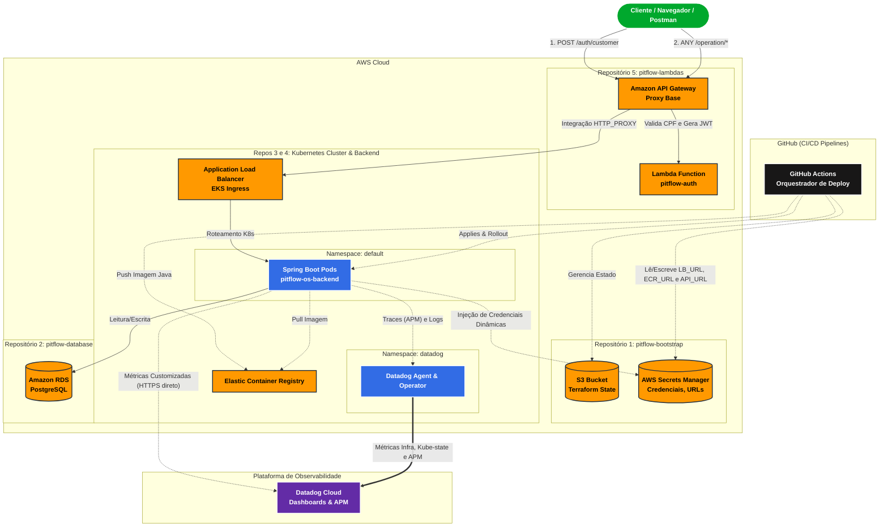

### Diagrama de componentes

```mermaid
flowchart TB
    classDef aws fill:#FF9900,stroke:#232F3E,stroke-width:2px,color:black,font-weight:bold;
    classDef k8s fill:#326CE5,stroke:#fff,stroke-width:2px,color:white,font-weight:bold;
    classDef github fill:#181717,stroke:#fff,stroke-width:2px,color:white,font-weight:bold;
    classDef datadog fill:#632CA6,stroke:#fff,stroke-width:2px,color:white,font-weight:bold;
    classDef client fill:#00A82D,stroke:#fff,stroke-width:2px,color:white,font-weight:bold;

    Client([Cliente / Navegador / Postman]):::client

    subgraph CI["GitHub (CI/CD Pipelines)"]
        Actions[GitHub Actions\nOrquestrador de Deploy]:::github
    end

    subgraph AWS["AWS Cloud"]

        subgraph Sec["Repositório 1: pitflow-bootstrap"]
            S3[(S3 Bucket\nTerraform State)]:::aws
            SM[(AWS Secrets Manager\nCredenciais, URLs)]:::aws
        end

        subgraph Edge["Repositório 5: pitflow-lambdas"]
            APIGW[Amazon API Gateway\nProxy Base]:::aws
            LambdaAuth[Lambda Function\npitflow-auth]:::aws
        end

        subgraph EKS["Repos 3 e 4: Kubernetes Cluster & Backend"]
            ALB[Application Load Balancer\nEKS Ingress]:::aws

            subgraph Pods["Namespace: default"]
                Backend[Spring Boot Pods\npitflow-os-backend]:::k8s
            end

            subgraph KubeSystem["Namespace: datadog"]
                DDAgent[Datadog Agent & Operator]:::k8s
            end

            ECR[Elastic Container Registry]:::aws
        end

        subgraph Data["Repositório 2: pitflow-database"]
            RDS[(Amazon RDS\nPostgreSQL)]:::aws
        end
    end

    subgraph Observability["Plataforma de Observabilidade"]
        DDCloud[Datadog Cloud\nDashboards & APM]:::datadog
    end

%% Fluxo de Usuário
    Client -- "1. POST /auth/customer" --> APIGW
    Client -- "2. ANY /operation/*" --> APIGW

    APIGW -- "Valida CPF e Gera JWT" --> LambdaAuth
    APIGW -- "Integração HTTP_PROXY" --> ALB

    ALB -- "Roteamento K8s" --> Backend
    Backend -- "Leitura/Escrita" --> RDS

%% Fluxo de Observabilidade (Corrigido para a sua realidade)
    Backend -. "Traces (APM) e Logs" .-> DDAgent
    Backend -. "Métricas Customizadas (HTTPS direto)" .-> DDCloud
    DDAgent == "Métricas Infra, Kube-state e APM" ==> DDCloud

%% Fluxos de CI/CD
    Actions -. "Gerencia Estado" .-> S3
    Actions -. "Lê/Escreve LB_URL, ECR_URL e API_URL" .-> SM
    Actions -. "Push Imagem Java" .-> ECR
    Backend -. "Pull Imagem" .-> ECR
    Actions -. "Applies & Rollout" .-> Backend
    Backend -. "Injeção de Credenciais Dinâmicas" .-> SM
```