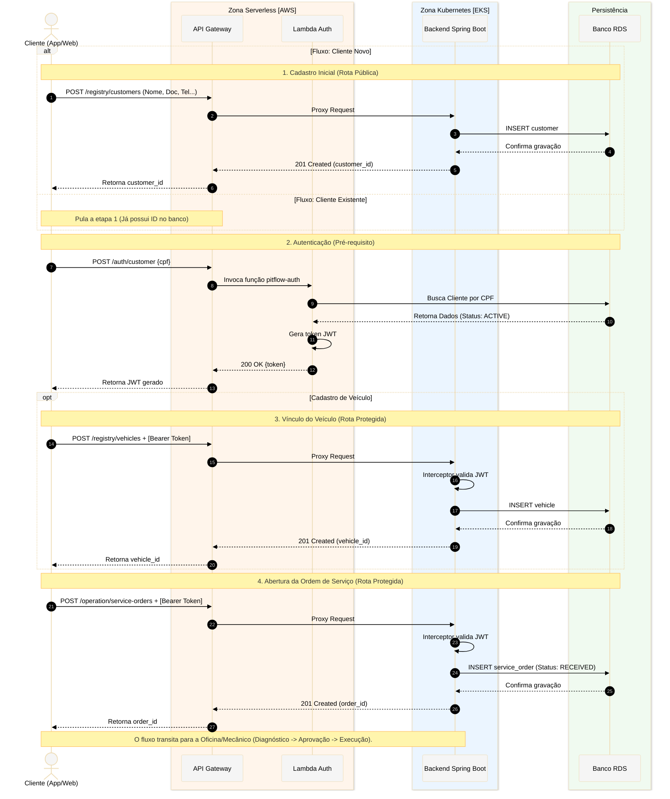

## Diagrama de sequencia
Fluxo de autenticação e abertura de ordens de serviço.

```mermaid
%%{init: {
  "theme": "base",
  "themeVariables": {
    "primaryTextColor": "#000000",
    "secondaryTextColor": "#000000",
    "tertiaryTextColor": "#000000",
    "lineColor": "#333333",
    "fontSize": "14px",
    "actorBkg": "#F5F5F5",
    "participantBkg": "#FFFFFF",
    "noteBkg": "#FFF3E0",
    "noteBorderColor": "#FFB74D"
  }
}}%%
sequenceDiagram
    autonumber
    
    actor Cliente as Cliente (App/Web)

    box rgb(255, 245, 235) Zona Serverless [AWS]
        participant API as API Gateway
        participant Lambda as Lambda Auth
    end

    box rgb(235, 245, 255) Zona Kubernetes [EKS]
        participant Backend as Backend Spring Boot
    end

    box rgb(240, 250, 240) Persistência
        participant DB as Banco RDS
    end

    alt Fluxo: Cliente Novo
        Note over Cliente, DB: 1. Cadastro Inicial (Rota Pública)
        Cliente->>API: POST /registry/customers (Nome, Doc, Tel...)
        API->>Backend: Proxy Request
        Backend->>DB: INSERT customer
        DB-->>Backend: Confirma gravação
        Backend-->>API: 201 Created (customer_id)
        API-->>Cliente: Retorna customer_id
    else Fluxo: Cliente Existente
        Note over Cliente, API: Pula a etapa 1 (Já possui ID no banco)
    end

    Note over Cliente, DB: 2. Autenticação (Pré-requisito)
    Cliente->>API: POST /auth/customer {cpf}
    API->>Lambda: Invoca função pitflow-auth
    Lambda->>DB: Busca Cliente por CPF
    DB-->>Lambda: Retorna Dados (Status: ACTIVE)
    Lambda->>Lambda: Gera token JWT
    Lambda-->>API: 200 OK {token}
    API-->>Cliente: Retorna JWT gerado

    opt Cadastro de Veículo
        Note over Cliente, DB: 3. Vínculo do Veículo (Rota Protegida)
        Cliente->>API: POST /registry/vehicles + [Bearer Token]
        API->>Backend: Proxy Request
        Backend->>Backend: Interceptor valida JWT
        Backend->>DB: INSERT vehicle
        DB-->>Backend: Confirma gravação
        Backend-->>API: 201 Created (vehicle_id)
        API-->>Cliente: Retorna vehicle_id
    end

    Note over Cliente, DB: 4. Abertura da Ordem de Serviço (Rota Protegida)
    Cliente->>API: POST /operation/service-orders + [Bearer Token]
    API->>Backend: Proxy Request
    Backend->>Backend: Interceptor valida JWT
    Backend->>DB: INSERT service_order (Status: RECEIVED)
    DB-->>Backend: Confirma gravação
    Backend-->>API: 201 Created (order_id)
    API-->>Cliente: Retorna order_id

    Note over Cliente, Backend: O fluxo transita para a Oficina/Mecânico (Diagnóstico -> Aprovação -> Execução).
```
