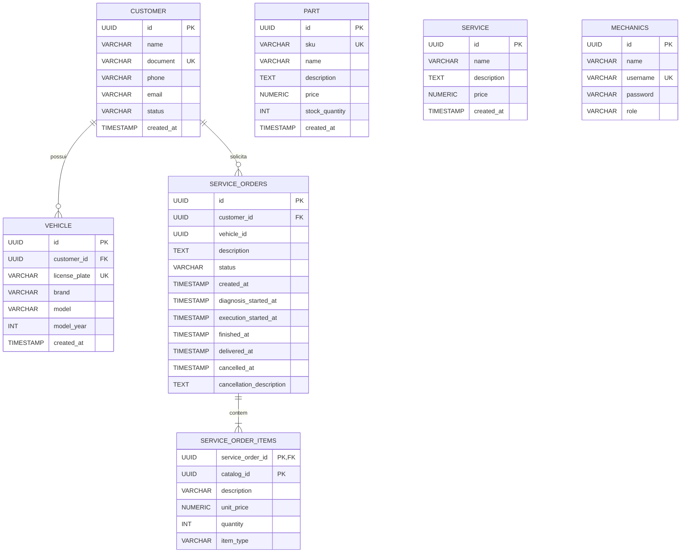

# Modelagem Relacional - Sistema de Oficina Mecânica

## 1. Visão Geral

O sistema foi modelado utilizando banco de dados relacional PostgreSQL, adotando uma estrutura normalizada e orientada à integridade referencial, visando garantir:

- consistência dos dados;
- rastreabilidade das ordens de serviço;
- facilidade de manutenção;
- escalabilidade futura;
- compatibilidade com ORM Hibernate/JPA;
- suporte transacional robusto.

A modelagem contempla os principais domínios do sistema:

- clientes;
- veículos;
- ordens de serviço;
- peças;
- serviços;
- mecânicos;
- itens da ordem de serviço.

---

# 2. Justificativa da Escolha do Banco de Dados

## PostgreSQL

O PostgreSQL foi escolhido como banco de dados principal devido às seguintes características:

### Integridade Relacional

O PostgreSQL possui excelente suporte a:

- foreign keys;
- constraints;
- transações ACID;
- índices;
- integridade referencial.

Esses recursos são fundamentais em sistemas transacionais, como oficinas mecânicas, onde inconsistências podem gerar perdas financeiras e operacionais.

---

### Compatibilidade com Java + Hibernate

O PostgreSQL possui alta compatibilidade com:

- Java 21;
- Spring Boot;
- Hibernate/JPA.

Além disso:

- suporta UUID nativamente;
- possui excelente desempenho com índices B-Tree;
- integra facilmente com ambientes Docker e Kubernetes.

---

### Escalabilidade

O banco suporta:

- particionamento;
- replicação;
- alta concorrência;
- crescimento gradual do sistema.

Isso permite evolução futura sem necessidade de migração tecnológica.

---

### Robustez Transacional

O domínio de ordens de serviço exige:

- consistência em gravações;
- atomicidade;
- rollback seguro;
- controle de concorrência.

O PostgreSQL atende esses requisitos de forma madura e consolidada.

---
### Conhecimento Prévio

A equipe já possui experiência com o PostegreSQL, reduzindo a curva de aprendizagem e tempo de implementação.

---

# 3. Ajustes Realizados no Modelo Relacional

## Inclusão de Foreign Key em service_orders.customer_id

Inicialmente, a tabela `service_orders` possuía apenas índice sobre `customer_id`, sem integridade referencial.

Foi adicionada a constraint:

```sql
CONSTRAINT fk_service_orders_customer
FOREIGN KEY (customer_id)
REFERENCES public.customer(id)
```

### Benefícios Obtidos

* impede ordens vinculadas a clientes inexistentes;
* aumenta consistência do banco;
* reduz risco de dados órfãos;
* melhora confiabilidade do domínio.

---

## Manutenção do Modelo Baseado em UUID

O sistema utiliza UUID como chave primária em todas as entidades.

### Motivos

* evita colisões em ambientes distribuídos;
* facilita integração futura entre microsserviços;
* reduz dependência de sequences;
* melhora compatibilidade com arquiteturas cloud-native.

---
## Manutenção do Relacionamento por IDs no Hibernate

Mesmo com a inclusão das Foreign Keys, o sistema manteve o uso de IDs explícitos no ORM:

```java
private UUID customerId;
```

Em vez de:

```java
@ManyToOne
private CustomerJpa customer;
```

### Justificativa

Essa abordagem:

* reduz acoplamento entre entidades;
* evita carregamentos desnecessários;
* melhora previsibilidade das queries;
* favorece Clean Architecture;
* simplifica serialização;
* reduz problemas com Lazy Loading.

---

# 4. Diagrama Entidade-Relacionamento (ER)



---

# 5. Explicação dos Relacionamentos

## CUSTOMER → VEHICLE

Relacionamento:

* 0:N

Um cliente pode possuir:

* nenhum;
* um;
* vários veículos.

Cada veículo pertence obrigatoriamente a um cliente.

---

## CUSTOMER → SERVICE_ORDERS

Relacionamento:

* 0:N

Um cliente pode possuir:

* nenhuma;
* uma;
* várias ordens de serviço.

Cada ordem pertence obrigatoriamente a um cliente.

A foreign key garante integridade referencial.

---

## SERVICE_ORDERS → SERVICE_ORDER_ITEMS

Relacionamento:

* 1:N

Uma ordem de serviço pode possuir múltiplos itens.

Os itens podem representar:

* peças;
* serviços.

Foi utilizada composição forte:

```sql
ON DELETE CASCADE
```

Assim, ao remover uma ordem de serviço:

* seus itens também são removidos automaticamente.

---

# 6. Estratégia de Catálogo de Itens

A tabela `service_order_items` utiliza:

```text
catalog_id
item_type
```

Essa estratégia permite representar:

* peças;
* serviços;

na mesma tabela de itens.

---

## Benefícios

* simplifica modelagem;
* reduz duplicidade estrutural;
* facilita cálculo financeiro;
* melhora flexibilidade futura.

---

## Trade-off

A tabela não possui FK direta para:

* `part`
* `service`

Isso foi uma decisão arquitetural para permitir:

* snapshots históricos;
* desacoplamento do catálogo;
* persistência do preço histórico.

Mesmo que uma peça seja alterada futuramente, a ordem preserva:

* descrição original;
* valor original;
* quantidade original.

---

# 7. Índices Criados

## service_orders

```sql
idx_so_customer_id
idx_so_status
idx_so_vehicle_id
```

### Objetivos

* acelerar buscas por cliente;
* acelerar filtros por status;
* melhorar consultas por veículo.

---

# 8. Considerações Arquiteturais

A modelagem foi construída visando:

* separação entre domínio e persistência;
* compatibilidade com Clean Architecture;
* uso eficiente do Hibernate;
* baixo acoplamento entre entidades;
* integridade garantida no banco.

O sistema mantém:

* regras críticas protegidas no PostgreSQL;
* flexibilidade no domínio Java;
* boa escalabilidade para evolução futura.

---

# 9. Conclusão

A modelagem relacional implementada apresenta:

* boa normalização;
* integridade referencial;
* consistência transacional;
* separação adequada entre entidades;
* flexibilidade arquitetural.

A solução adotada é adequada para sistemas transacionais de oficina mecânica e fornece uma base sólida para futuras evoluções do projeto.
