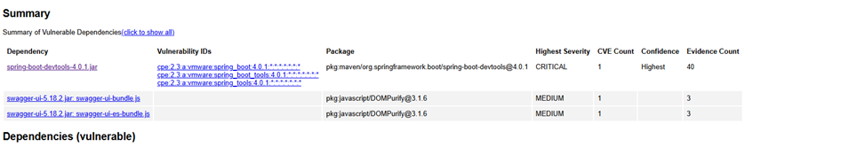
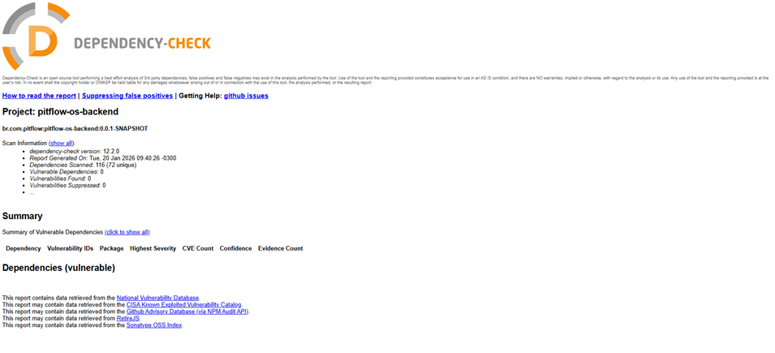

# Análise de dependências com OWASP

O OWASP Dependency-Check complementa JaCoCo e Sonar ao realizar análise de
composição de software (SCA) sobre dependências conhecidas por CVEs.

## Execução

Solicite uma chave da NVD e forneça-a sem versionar seu valor:

```bash
mvn org.owasp:dependency-check-maven:check \
  -Dnvd.api.key="$NVD_API_KEY"
```

O relatório é gerado em `target/dependency-check-report.html`. Uma falha de
download da base NVD não equivale a ausência de vulnerabilidades; a execução
somente serve como evidência quando termina com a base atualizada.

## Evidências históricas

As imagens abaixo registram a análise realizada na fase anterior. Elas não
substituem uma nova execução para a entrega atual.





Na análise histórica, os principais pontos estavam relacionados ao DevTools e
aos assets do Swagger UI. O DevTools permanece restrito ao escopo de teste e a
imagem de produção é construída em múltiplos estágios. Novos resultados devem
ser avaliados conforme o relatório corrente, sem assumir que a evidência antiga
continua válida.
